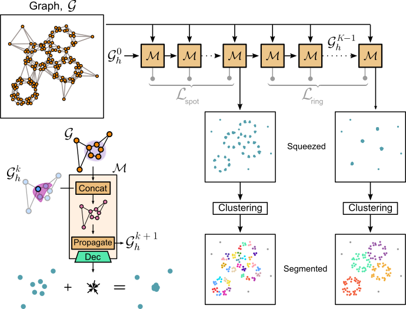

# Spatial Clustering of Molecular Localizations with MIRO

**MIRO** (Multifunctional Integration through Relational Optimization) is a geometric deep learning framework that enhances clustering algorithms by transforming complex point clouds into structured, compact representations. It enables more robust clustering of single-molecule localization data using recurrent graph neural networks (rGNNs).

## How it works?
**MIRO** learns to pull together localizations belonging to the same structure, producing spatially compact, well-separated clusters. This transformation enables standard algorithms like DBSCAN to perform significantly better — especially in challenging scenarios involving varying densities, blinking artifacts, or multiple cluster types.

<div style="background-color: white; padding: 10px; display: inline-block;">
  
</div>

## Key Features  
- **Improved Clustering Performance:** MIRO increases the efficiency of existing clustering algorithms by transforming point clouds into an optimized format.  
- **Simplified Parameter Selection:** By enhancing the differentiation among clusters and their separation from the background, **MIRO** streamlines parameter selection for clustering methods like DBSCAN.
- **Single-Shot and Few-Shot Learning:** **MIRO**’s single- or few-shot learning capability allows it to generalize across scenarios with minimal training, making it highly efficient and versatile.
- **Multiscale Clustering:** **MIRO**’s recurrent structure allows for identifying patterns at different scales. 
- **Broad Applicability:** **MIRO** is effective across datasets with diverse cluster shapes and symmetries.

<!---
## Dependencies  
**MIRO** is included as part of [deeplay](https://github.com/DeepTrackAI/deeplay). 

Install deeplay and unlock the full potential of **MIRO**. 
```bash
pip install deeplay
```
-->

## Installation

To install MIRO and its dependencies:

1. Make sure you have **Python 3.9** or higher installed.

2. Clone the repository to your local machine:
   ```bash
   git clone https://github.com/DeepTrackAI/MIRO.git

3. Install the necessary dependencies:
   ```bash
   pip install -r requirements.txt

**MIRO** is included as part of [deeplay](https://github.com/DeepTrackAI/deeplay), a modular framework for deep learning.

## Tutorials
Get a hands-on experience with MIRO through the notebooks 

-**Benchmark:** Reproduce MIRO's performance on benchmark dataset, either training your model or loading pretrained models

-**Single Shot:**

-**Multiscale:**

-**Multishape:**

## Citation
If you use **MIRO** in your research, please cite:
```
@article{pineda2024spatial,
  title={Spatial Clustering of Molecular Localizations with Graph Neural Networks},
  author={Pineda, Jes{\'u}s and Mas{\'o}-Orriols, Sergi and Bertran, Joan and Goks{\"o}r, Mattias and Volpe, Giovanni and Manzo, Carlo},
  journal={arXiv preprint arXiv:2412.00173},
  year={2024}
}
```

